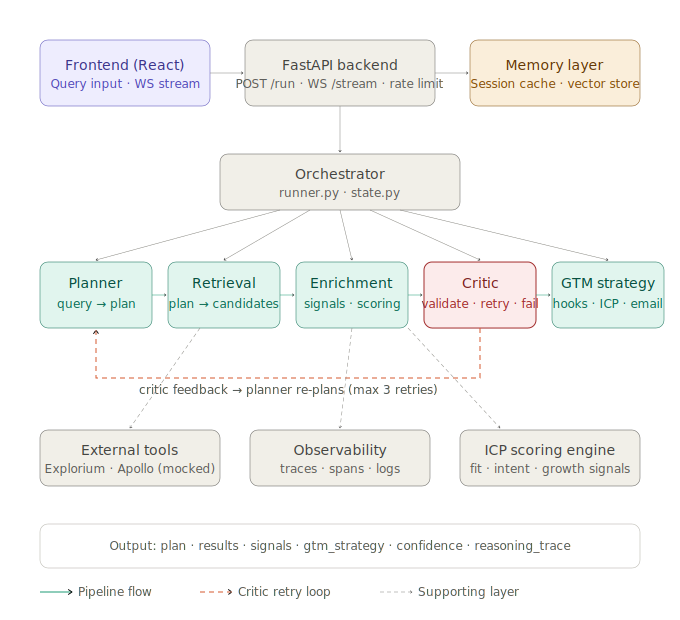

# GTM Intelligence

> Multi-agent outbound intelligence engine. Takes a natural language ICP query and returns enriched, scored target accounts with personalized GTM strategy — through iterative self-correction, not single-pass generation.

---

## 🌐 Live Demo

| | |
|---|---|
| Frontend | https://gtm-intelligence-taupe.vercel.app/ |
| Backend API | https://gtm-intelligence.onrender.com |
| WebSocket | wss://gtm-intelligence.onrender.com/ws/run |

---

## Why this system

Most GTM tooling produces static outputs: run a query, get a list, move on. Real GTM teams don't work that way — they validate, refine, and adapt based on feedback before acting.

This system is designed to mirror that workflow. It combines data retrieval, ICP scoring, and strategy generation inside a critic-driven feedback loop that iteratively improves its own outputs. If results are weak, misaligned, or hallucinated, the system catches it and re-plans — without human intervention.

The result is a pipeline that behaves less like a prompt chain and more like a junior analyst that checks its own work.

---

## Architecture

The system is orchestrated as an iterative multi-agent pipeline with a critic-driven feedback loop, enabling self-correction and improved output quality over multiple passes.



All agents share a central `AgentState` object. The Critic evaluates enriched results and returns a structured verdict. On `RETRY`, it feeds specific, machine-readable feedback back to the Planner — which adjusts its plan and re-runs the full pipeline. This loop runs up to 3 times, preserving the full reasoning trace across every attempt.

---

## Design Decisions

**Critic-driven retry loop over single-pass output**
Most pipelines trust their own output. This system doesn't. The Critic agent validates results before they reach the user — checking for hallucinations, region/industry mismatches, missing signals, and low relevance. On failure, it generates structured feedback (not just a flag) that the Planner uses to re-plan. This makes the system self-correcting without manual intervention.

**Heuristic scoring over hardcoded ranking**
Retrieval and enrichment use weighted multi-factor scoring — signal weights, employee bands, funding stage, intent scores — rather than fixed ordering. This means results are ranked by genuine ICP fit, not position in a database.

**Soft matching and fallback hierarchy**
Strict filters can over-constrain queries and return nothing useful. The retrieval layer degrades gracefully: exact match → soft industry/region match → diverse sample fallback. This prevents empty results from propagating through the pipeline.

**Simulated real-world data imperfections**
The system is built to handle missing fields, schema inconsistencies, and partial API failures — not just clean inputs. Enrichment exceptions skip the affected record and continue; GTM failures surface an error without crashing the run. This reflects how production data actually behaves.

**Retry cap at 3 cycles**
Unlimited retries would mask bad queries and inflate latency. Three cycles is enough to recover from retrieval misses and soft failures while forcing the system to surface a hard stop (`FAIL`) when the query is genuinely unanswerable.

---

## Handling Ambiguity

Vague or incomplete queries are a real input condition, not an edge case. The system handles them through three mechanisms:

- **Soft matching in retrieval** — when strict filters return too few candidates, the retrieval layer expands to broader keyword and region matching before falling back to a diverse sample
- **Filter relaxation on retry** — if the Critic rejects results as too narrow or misaligned, the Planner can widen region scope, relax industry constraints, or shift entity type on the next pass
- **Confidence signalling** — every pipeline run produces a `confidence` score (0.0–1.0) so downstream consumers know how much to trust the output

---

## Key Features

### Multi-Agent Orchestration
Five specialized agents with clear separation of concerns:
- **Planner** — converts natural language query into a structured execution plan (`entity_type`, `filters`, `tasks`, `strategy`, `confidence`)
- **Retrieval** — fetches and scores candidate companies using industry + region + keyword matching with soft fallback
- **Enrichment** — computes ICP scores, buying signals, insights, and `why_this_result` explanations per account
- **Critic** — validates results for relevance, hallucinations, region/industry mismatch, quality, and signal presence; generates structured feedback for replanning
- **GTM Strategy** — generates personalized email hooks, multi-persona messaging, and competitive positioning

### Critic Feedback Loop
The Critic is not just a validator — it is a feedback engine. It returns `PASS | RETRY | FAIL` with a structured reason. On `RETRY`, that reason is stored in `state.memory["critic_feedback"]` and passed directly to the Planner, which uses it to adjust region, industry, or search scope before re-running the full pipeline. The full reasoning trace is preserved across all retry cycles, giving complete visibility into how the system corrected itself.

### Memory System
- **SessionMemory** — TTL-based exact query cache (5 min). Repeat queries return instantly without re-running the pipeline.
- **VectorStore** — keyword-similarity store of past query→result pairs. Similar future queries are augmented with relevant past records and signals, improving retrieval quality over time.

### ICP Scoring Engine
Multi-factor scoring in `enrichment.py`:
- Signal weights (`growth_funding`, `hiring_aggressively`, `mid_market_growth`, etc.)
- Employee band scoring
- Funding stage scoring
- Apollo intent score boost
- Explorium GTM fit boost
- Churn risk adjustment

### Buying Signal Detection
Signals detected per company: `growth_funding`, `mid_market_growth`, `enterprise_scale`, `early_stage_team`, `hiring_aggressively`, `churn_risk`, `late_stage`.

### Multi-Persona Targeting
GTM Strategy agent generates tailored messaging for VP Sales, CEO, and CTO — each with persona-specific pain points, value props, hooks, and CTAs.

### Competitive Intelligence
Per-company competitive stack inference and positioning strategy based on industry and detected signals.

### Streaming via WebSocket
The frontend connects to `ws://localhost:8000/ws/run` and receives live `agent_update` events as each pipeline step completes, with real-time timeline updates in the UI.

---

## Failure Handling

The system is designed to degrade gracefully under real-world conditions — partial data, API failures, and over-constrained queries are all handled explicitly rather than crashing the run.

| Failure Mode | Response |
|---|---|
| Empty retrieval | Soft fallback → industry/region soft match → diverse sample |
| Critic RETRY | Planner re-plans with structured feedback; up to 3 attempts |
| Critic FAIL | Hard stop, return errors |
| Enrichment exception | Skip record, continue pipeline |
| GTM exception | Return empty strategy, surface error |
| Critic crash | Default to PASS, log warning |

---

## Tech Stack

| Layer | Technology |
|---|---|
| Backend | FastAPI + Python |
| WebSocket | FastAPI WebSocket |
| Rate Limiting | slowapi |
| Frontend | React + TypeScript + Vite |
| Memory | In-memory TTL cache + keyword vector store |
| Observability | Structured logging + reasoning trace + span tracer |

---

## Running Locally

```bash
# Backend
cd backend
pip install -r requirements.txt
uvicorn main:app --reload --port 8000

# Frontend
cd frontend
npm install
npm run dev
```

Backend runs on `http://localhost:8000`  
Frontend runs on `http://localhost:5173`

---

## API

### POST `/run`
Rate limited: 20 requests/minute

```json
{ "query": "Find high-growth AI SaaS companies in the US" }
```

### WebSocket `/ws/run`
Send: `{ "query": "..." }`  
Receive: stream of `agent_update` events + final `result`

---

## Observability

Every pipeline run produces a complete audit trail:
- `reasoning_trace` — human-readable log of every agent decision
- `spans` — structured tracer events per agent
- `errors` — accumulated error list
- `retry_count` — number of critic-triggered replanning cycles
- `confidence` — final pipeline confidence score (0.0–1.0)